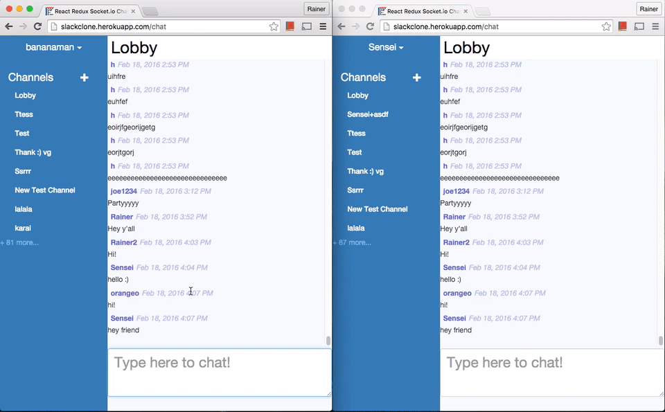

# React-redux-socketio-chat


To see the live version of the app go to http://slackclone.herokuapp.com

## Use Guide

First off, clone the repository and then `cd react-redux-socketio-chat`and `npm install`

You can create channels with the + sign on the nav bar on the left.
If you click on a user's name to send him a private message (opens a private channel)

### Setting up MongoDB

Note: You need MongoDB set up and running to run the code locally. [Installation instructions](https://docs.mongodb.org/manual/installation/)

Once you've installed MongoDB start up the MongoDB server in a new terminal with the following commands:

```
mkdir db
mongod --dbpath=./db --smallfiles
```

Then open a new terminal and type in `mongo` and type in `use chat_dev`
This is your database interface.  You can query the database for records for example: `db.users.find()` or `db.stats()`.  If you want to remove all channels for example you can type `db.channels.remove({})`.

Now that you've done all that, you can go go ahead and code away!

### Development

```
npm run dev
```
And then point your browser to `localhost:3000`

Note:
This program comes with [redux-dev tools](https://github.com/gaearon/redux-devtools)
* To SHOW or HIDE the dev tool panel press ctrl+h
* To change position press ctrl+m

### Production

```
npm run build
npm start
```
And then point your browser to `localhost:3000`

## Helpful Resources and Inspiring Projects

* Erikras' universal redux example: https://github.com/erikras/react-redux-universal-hot-example
* The facebook react flux-chat example: https://github.com/facebook/flux/tree/master/examples/flux-chat
* The awesome community of reactiflux https://discordapp.com/channels/102860784329052160/102860784329052160

## Todos
* Implement virtual scrolling for the chat and channel modal, so that the dom elements load faster!
* Figure out a way to make the initial load quicker, loading only above the fold content? pagination? or some other idea
